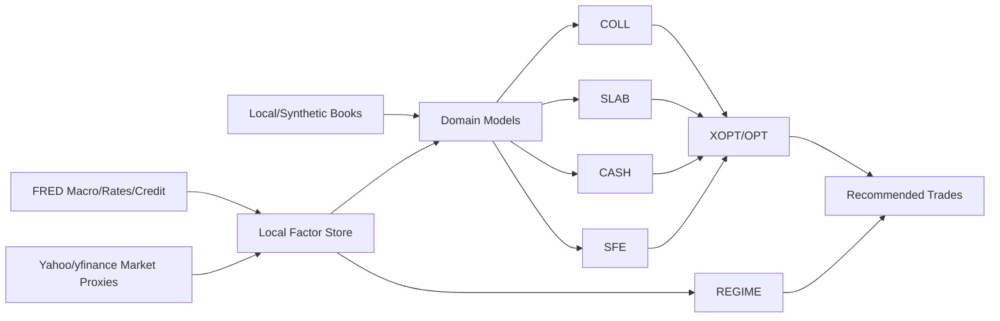

# Market Terminal Review & Roadmap

Date: 2026-06-18

## Executive Summary

The current `market_terminal` build is already pointed in the right institutional direction: a dense, keyboard-driven securities finance terminal with modules for markets, securities lending, prime finance, collateral, cash, sources and uses, optimization, trading, alerts, AI, and a full Economics & Macro section. The strongest design choice is the explicit linkage between macro conditions and securities finance economics. This is the right spine for collateral management, optimization, securities lending, and funding analytics because those businesses are driven by rates, credit, liquidity, balance sheet usage, and asset availability.

The main opportunity is to move from deterministic demo generators toward a local, adapter-driven data and analytics layer. FRED can anchor macro, rates, credit-spread, liquidity, and policy-rate data. Yahoo Finance/yfinance can provide prototype-grade prices, volumes, ETFs, options-adjacent signals, and asset proxies, while staying behind a replaceable `MarketDataAdapter`. The repo already contains the beginning of that architecture in `market_data_pipeline`, including FRED and Yahoo connectors, DuckDB/Parquet storage, lineage, data quality checks, and FastAPI endpoints.

Recommended direction: build a local "collateral and financing intelligence layer" that combines FRED macro factors, Yahoo market proxies, synthetic/internal books, and optimization outputs. Treat Yahoo as research/local-only, not a production dependency. Preserve clean upgrade paths to paid APIs such as Bloomberg, Refinitiv/LSEG, FactSet, S&P/Markit, DataLend, EquiLend, FIS/Loanet, Pirum, Broadridge, Hazeltree, IHS Markit/S&P securities finance, TriOptima, Acadia, ICE, CME, DTCC, BNY, or custody/prime internal feeds.

## Current Build Review

### What Is Already Strong

- `ECON`, `CURV`, `INFL`, `GCPI`, `GPOL`, `CRDT`, `FOMC`, `STAT`, `EML`, and `SFE` form a credible macro suite.
- `SFE` is the clearest domain bridge: repo complex, rate sensitivities, reinvestment ladder, and macro-to-business linkage.
- `COLL`, `CASH`, `SXU`, and `OPT` already model the core workflow: margin requirements, collateral eligibility, constraints, funding sources, allocation, shadow prices, and recommended trades.
- `SLAB` has the right basic securities lending shape: lendable inventory, loan book, borrow demand, utilization, specials, HTB names, revenue by borrower/security/asset class, and beneficial-owner-to-borrower flow.
- `market_data_pipeline` is a strong foundation for local scaling: adapter interfaces, FRED/Yahoo connectors, raw/silver/gold layers, DuckDB, Parquet, quality checks, and FastAPI service boundaries.
- The app already communicates data provenance with `LIVE · FRED`, `ETL · MACRO`, `SIM`, and deterministic fallbacks. Keep that pattern.

### Main Gaps

- Collateral and lending pages are still mostly deterministic domain data rather than computed from a canonical factor/book model.
- Macro signals do not yet flow directly into optimizer objective functions, haircuts, lendable-value forecasts, or funding-cost curves.
- Yahoo Finance is present in the Python pipeline but not yet fully feeding terminal pages through a shared local API.
- The repo has two data worlds: TypeScript deterministic generators in `src/data/*` and the Python medallion pipeline. These should converge through typed API responses or exported local JSON/Parquet snapshots.
- There is no dedicated collateral asset pricing/risk module, no eligibility rule engine, no securities-lending rate estimator, and no margin/liquidity stress cockpit.
- Optimization results are realistic in shape but not yet backed by a real local solver run.

## API Positioning

### FRED

Use FRED as the official free macro source. The existing FRED endpoint pattern is right: server-side only, cached, units-corrected, and provenance-aware. FRED can support:

- Treasury rates and curve factors.
- SOFR, EFFR, IORB, RRP, fed funds and policy backdrop.
- CPI, PCE, labor, growth, recession, financial conditions, money/reserves, and banking/liquidity series.
- ICE BofA credit spread series available through FRED.
- Release calendars and historical macro time series.

Reference: https://fred.stlouisfed.org/docs/api/fred/series_observations.html

### Yahoo Finance / yfinance

Use Yahoo/yfinance for local research and prototyping only. It can provide useful public-market proxies, but it is not a licensed securities finance, collateral, corporate actions, or redistribution-grade feed. The current `YahooConnector` stance is correct: cache aggressively, rate-limit, store raw responses, and keep the adapter replaceable.

Yahoo/yfinance can support:

- Equity/ETF prices and returns for collateral assets and lendable inventory.
- Proxy baskets for sectors, regions, factors, vol, rates ETFs, credit ETFs, commodities, FX, and crypto.
- Volume, volatility, drawdown, beta, momentum, and liquidity proxy analytics.
- Options-chain-derived prototype signals where available, with clear caveats.

Reference: https://ranaroussi.github.io/yfinance/

## Recommended New Modules

### 1. `CFI` - Collateral Factor Intelligence

Purpose: turn collateral assets into scored objects using pricing, liquidity, credit, macro, and eligibility factors.

Data start:

- Yahoo: price, return, volatility, drawdown, volume, ETF proxy liquidity.
- FRED: Treasury curve, SOFR/EFFR, HY/IG OAS, financial conditions, recession risk proxies.
- Local/synthetic: collateral type, haircut schedule, eligibility matrix, concentration limits.

Features:

- Collateral score by asset: liquidity, haircut drag, opportunity cost, wrong-way risk, stress loss, eligibility breadth.
- Factor decomposition: rate duration, equity beta, credit beta, FX proxy, liquidity stress.
- "Best-to-post" and "best-to-keep" rankings.
- Collateral watchlist for assets whose score deteriorates after macro/market moves.
- Upgrade path: Bloomberg BVAL, ICE pricing, Refinitiv, FactSet, Markit, internal risk/Pricing feeds.

### 2. `ELIG` - Eligibility & Schedule Engine

Purpose: model agreement-level collateral rules in a reusable, explainable engine.

Data start:

- Local JSON/YAML rule books for CSA, GMRA, MSLA, CCP, and client schedules.
- FRED/Yahoo for dynamic haircut stress overlays.

Features:

- Agreement eligibility matrix by counterparty, collateral type, issuer, currency, rating, maturity, concentration bucket.
- Rule explainability: why an asset is accepted, rejected, haircut-adjusted, or concentration-blocked.
- What-if changes to haircuts, concentration caps, minimum cash buffers, wrong-way limits.
- Exportable optimization constraints.
- Upgrade path: Acadia, TriOptima, Calypso/Murex, internal legal agreement database.

### 3. `HCT` - Dynamic Haircut & Stress Lab

Purpose: create market-aware haircut recommendations for collateral and financing.

Data start:

- Yahoo: realized volatility, drawdowns, price gaps, volume shocks.
- FRED: credit spreads, curve moves, financial stress/liquidity proxies, recession indicators.

Features:

- Base haircut vs stressed haircut by asset class and security.
- Macro-driven haircut overlays: HY OAS widening, VIX proxy, curve shock, liquidity stress.
- Backtested stress windows: GFC, COVID, 2022 rates shock, regional bank stress.
- Haircut P&L impact and optimization feasibility impact.
- Upgrade path: internal VaR/stress engine, vendor risk models, CCP margin feeds.

### 4. `LENDRATE` - Securities Lending Rate Estimator

Purpose: estimate fair borrow fees, GC/specials classification, and demand pressure using public proxies plus local inventory.

Data start:

- Yahoo: price momentum, volume, volatility, short-interest proxies where available, ETF/sector moves.
- FRED: policy rate, SOFR, credit spreads, financial conditions.
- Local/synthetic: utilization, lendable supply, borrower demand, historical borrow fee.

Features:

- Fair borrow fee model: GC, warm, special, HTB.
- Explainable drivers: utilization, price momentum, volatility, market cap proxy, sector stress, macro regime.
- Revenue opportunity queue: high bid vs fair value, underpriced loans, recall candidates.
- Confidence and missing-data warnings.
- Upgrade path: DataLend, EquiLend, S&P/Markit securities finance, FIS/Loanet, internal rate history.

### 5. `REINV` - Cash Collateral Reinvestment Desk

Purpose: deepen the existing SFE reinvestment ladder into a full cash collateral analytics module.

Data start:

- FRED: SOFR, EFFR, IORB, RRP, Treasury bill yields, curve tenors, money market/repo proxies.
- Yahoo: ETF proxies for ultra-short duration, bills, agencies, credit ETFs.
- Local/synthetic: cash collateral balances, maturity ladder, liquidity buckets.

Features:

- Reinvestment yield, WAM/WAL, liquidity bucket, credit bucket, and stress liquidity.
- Fed path scenario impact on reinvestment income.
- Ladder optimizer: maximize yield subject to liquidity, credit, WAM, counterparty, and regulatory constraints.
- Break-even rebate and client revenue share analytics.
- Upgrade path: actual repo/deposit/MMF feeds, custodian cash ladders, Bloomberg/ICE short rates.

### 6. `LIQ` - Liquidity & Funding Stress Cockpit

Purpose: connect cash, collateral, margin, and macro into a liquidity survival dashboard.

Data start:

- FRED: SOFR/EFFR spreads, reserves, RRP, Treasury rates, credit spreads, financial stress indexes.
- Yahoo: asset liquidity and drawdown proxies.
- Local/synthetic: funding sources, liquidity buffers, margin calls, collateral pools.

Features:

- Intraday and multi-day liquidity ladder.
- Margin call shock simulator by counterparty and product.
- Funding source reliability and cost ranking.
- LCR/NSFR-style internal measures.
- Early-warning indicators: SOFR-EFFR spread, credit OAS, equity drawdown, volatility proxy, liquidity score.
- Upgrade path: treasury systems, bank balance feeds, payment rails, intraday cash APIs.

### 7. `BOX` - Internal Box & Inventory Optimizer

Purpose: optimize the use of internal inventory across lending, prime, collateral posting, and trading constraints.

Data start:

- Yahoo: current market values, volatility, liquidity proxies.
- Local/synthetic: inventory, restrictions, beneficial-owner mandates, loan book, recallability, collateral needs.

Features:

- "Use of security" decisioning: lend, pledge, keep for liquidity, use internally, recall, substitute.
- Opportunity cost of lending vs collateral value.
- Recall risk score and client impact.
- Beneficial-owner allocation fairness and revenue split analytics.
- Upgrade path: custody books, order management, loanet/equilend, internal position systems.

### 8. `XOPT` - Real Local Optimization Runner

Purpose: replace simulated optimization outputs with reproducible local solver runs.

Data start:

- Existing `src/data/collateral.ts`, `src/data/optimization.ts`, and `market_data_pipeline` gold outputs.
- OR-Tools first; optional Pyomo/CBC; Gurobi later.

Features:

- Real LP/MIP model for collateral allocation.
- Objective: minimize funding/opportunity/haircut cost and maximize revenue capture.
- Constraints: availability, eligibility, concentration, haircuts, liquidity buffers, recall horizon, counterparty limits, currency mismatch.
- Output: allocation, dual values, binding constraints, recommended trades, infeasibility explanations.
- Upgrade path: Gurobi, enterprise scheduler, audit trail, approval workflow.

### 9. `REGIME` - Macro Regime to Desk Playbook

Purpose: convert macro states into desk actions for lending, collateral, cash, and optimization.

Data start:

- FRED macro suite: curve, inflation, labor, credit spreads, financial conditions.
- Yahoo cross-asset proxies: SPY, QQQ, IWM, HYG, LQD, TLT, SHY, GLD, UUP, VIX proxy.

Features:

- Regime classifier: easing, tightening, risk-on, risk-off, stagflation, recession watch.
- Recommended desk playbooks: tighten haircuts, raise cash buffer, term out funding, recall specials, favor HQLA, reduce HY collateral acceptance.
- Link each recommendation to live factors.
- Upgrade path: proprietary macro model, trader overrides, historical P&L attribution.

### 10. `DATAOPS` - Data Health, Lineage & Provider Console

Purpose: make the data layer visible and trustworthy.

Data start:

- Existing pipeline manifest and quality tables.

Features:

- Provider status: FRED, Yahoo, synthetic, cached, failed, stale.
- Series coverage and freshness by module.
- Data quality exceptions and fallback explanations.
- Adapter comparison when paid feeds are introduced.
- "Can this panel go production?" readiness score.

## Economic & Macro Enhancements

### SFE Enhancements

- Add explicit `macro_factor_id` links to each SFE metric.
- Convert rate sensitivities from static demo rows into derived exposures by book segment.
- Add scenarios: Fed cuts/hikes, curve steepener/flattener, repo squeeze, reserve drain, credit shock, equity volatility shock.
- Add P&L bridge: rebate, reinvestment yield, funding cost, specialness, balance-sheet cost, client split.

### STAT Enhancements

- Add preset study packs:
  - Rates to reinvestment income.
  - HY OAS to haircut stress.
  - Equity vol to HTB fees.
  - Curve inversion to lending demand.
  - SOFR/EFFR spread to funding stress.
- Persist selected studies as reusable signal definitions for `REGIME`, `CFI`, and `LENDRATE`.

### CRDT Enhancements

- Add collateral haircut impact from IG/HY spread widening.
- Add counterparty stress overlay and wrong-way-risk warnings.
- Add credit collateral substitution recommendations.

### CURV/FOMC Enhancements

- Push forward-rate and implied-policy scenarios into `REINV`, `CASH`, `COLL`, and `OPT`.
- Add term funding carry dashboard: overnight vs 1M/3M/6M reinvestment.

### CAL Enhancements

- Tag events by downstream sensitivity:
  - `Rates P&L`
  - `Haircut Risk`
  - `Borrow Demand`
  - `Funding Liquidity`
  - `Margin Risk`
- Add pre/post release factor move summaries.

## Data Architecture Roadmap

### Phase 1: Local Data Contract

- Define a canonical TypeScript API contract for market series, macro series, collateral assets, agreements, positions, loans, margin calls, and optimization outputs.
- Add a local API bridge from `market_data_pipeline` to the Next app:
  - `GET /snapshot/market`
  - `GET /snapshot/rates`
  - `GET /series/{id}`
  - `GET /collateral/factors`
  - `GET /lending/rate-estimates`
  - `GET /optimization/runs/{id}`
- Keep deterministic fallbacks for all modules.

### Phase 2: Factor Store

- Create a local factor store table:
  - `factor_id`
  - `source`
  - `vendor_symbol`
  - `series_id`
  - `date`
  - `value`
  - `transform`
  - `frequency`
  - `quality_status`
  - `as_of`
- Build initial factors:
  - Rates: SOFR, EFFR, IORB, RRP, DGS1M-DGS30.
  - Curve: 2s10s, 3m10y, level/slope/curvature.
  - Credit: IG OAS, HY OAS, rating OAS.
  - Liquidity: reserves, RRP, stress indexes.
  - Market proxies: SPY, QQQ, IWM, HYG, LQD, TLT, SHY, BIL, GLD, UUP, sector ETFs.
  - Derived: realized vol, beta, drawdown, momentum, liquidity score.

### Phase 3: Domain Models

- Convert `src/data/collateral.ts` and `src/data/securitiesLending.ts` from pure generators to model layers that can consume:
  - local synthetic book data,
  - factor store values,
  - optimization outputs,
  - optional live pipeline API data.
- Keep seeded demo data as a fixture source.

### Phase 4: Real Optimization

- Implement OR-Tools collateral optimizer in Python.
- Expose solver runs through FastAPI.
- Store model inputs and outputs for auditability.
- Render real dual values, allocation deltas, infeasibility reasons, and recommended trades in `OPT` and `COLL`.

### Phase 5: Provider Upgrades

- Add paid-provider adapters without changing terminal components:
  - `MarketDataAdapter`
  - `MacroDataAdapter`
  - `SecurityFinanceAdapter`
  - `CollateralPricingAdapter`
  - `AgreementRulesAdapter`
  - `OptimizerAdapter`
- Add provider precedence:
  - internal official feed,
  - licensed vendor,
  - FRED/Yahoo prototype feed,
  - deterministic synthetic fallback.

## Suggested Implementation Order

### Sprint 1: Data Unification

Deliverables:

- Add a `docs/data_contract.md` or OpenAPI schema for terminal-facing data.
- Add `market_data_pipeline` endpoint wrappers consumed by Next route handlers.
- Surface provider/source/freshness in `MKT`, `COLL`, `SLAB`, `SFE`, and `OPT`.
- Add a small factor catalog for 20-30 core FRED/Yahoo series.

Acceptance criteria:

- Terminal can run with synthetic data only.
- Terminal can run with FRED and Yahoo locally when available.
- Every live-derived panel shows source, timestamp, and fallback status.

### Sprint 2: Collateral Factor Intelligence

Deliverables:

- Build `CFI` module.
- Add collateral factor scoring model.
- Add dynamic haircut overlays.
- Add collateral watchlist and best-to-post ranking.

Acceptance criteria:

- UST, agency, IG credit, HY credit, equity, cash, gold, and FX cash collateral receive explainable scores.
- Scores update when market/macro factors change.
- Results can be used by `COLL` and `OPT`.

### Sprint 3: Real Local Optimizer

Deliverables:

- Implement OR-Tools collateral allocation model.
- Add solver input/output persistence.
- Replace simulated `OPT` runs with real local runs where data exists.
- Keep simulated fallback.

Acceptance criteria:

- User can run baseline and scenario optimizations locally.
- Binding constraints and shadow prices are real solver outputs.
- Infeasible cases explain which constraints conflict.

### Sprint 4: Lending Rate Estimator

Deliverables:

- Build `LENDRATE` module or add tab to `SLAB`.
- Estimate fair borrow fee and HTB classification.
- Add opportunity queue.

Acceptance criteria:

- Borrow fee estimates show model drivers and confidence.
- `SLAB` highlights underpriced loans and missed specials.
- Model works with Yahoo/FRED/local data and upgrades cleanly to securities finance vendors.

### Sprint 5: Liquidity & Reinvestment

Deliverables:

- Expand `SFE` into `REINV` or add a deeper cash collateral submodule.
- Add liquidity stress cockpit.
- Link FOMC path and curve scenarios to reinvestment income and funding cost.

Acceptance criteria:

- Desk can see Fed path impact on cash collateral returns.
- Liquidity ladder flags shortfalls under margin/funding shocks.
- Outputs feed `CASH`, `COLL`, and `OPT`.

## Local Feature Backlog

### High Priority

- Provider health/status panel.
- Canonical factor catalog.
- Collateral score and dynamic haircut model.
- OR-Tools optimizer.
- Agreement eligibility matrix.
- Lending fair-rate estimator.
- Macro-to-book P&L bridge.
- Scenario library shared across modules.

### Medium Priority

- Data lineage drilldowns.
- Stored optimization runs.
- Backtest notebooks for factor signals.
- Alert rules from macro/factor thresholds.
- Exportable daily desk pack.
- Saved user workspaces and command presets.

### Later

- AI copilot over local DuckDB/Parquet data.
- Natural-language scenario builder.
- Approval workflow for recommended collateral moves.
- Multi-currency funding basis module.
- Corporate action/recall event module.
- Beneficial-owner mandate compliance module.

## Module Dependency Map

## Production Upgrade Principles

- Keep FRED as the preferred free macro source.
- Keep Yahoo/yfinance local-only, cached, throttled, and replaceable.
- Store raw provider payloads before transforms.
- Make every displayed value traceable to provider, symbol/series, date, transform, and run id.
- Avoid hard-coding vendor-specific semantics into UI components.
- Make synthetic fallback an explicit provider, not hidden mock data.
- Separate "book of record" data from public proxy factors.
- Treat recommendations as explainable analytics, not black-box model outputs.

## Practical Next Step

Build `CFI` first. It is the highest-leverage bridge between the existing macro stack and the optimization/collateral/securities-lending stack. It can start entirely locally with FRED, Yahoo/yfinance, and synthetic book data, but its scoring outputs immediately become useful inputs for `COLL`, `SLAB`, `CASH`, `SFE`, and `OPT`.
