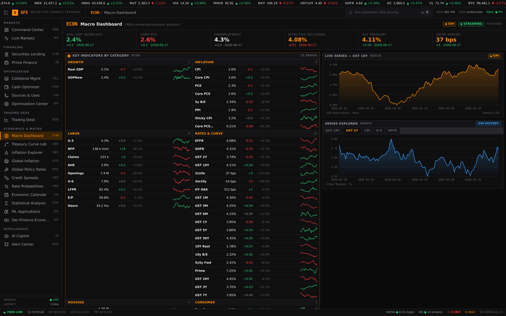
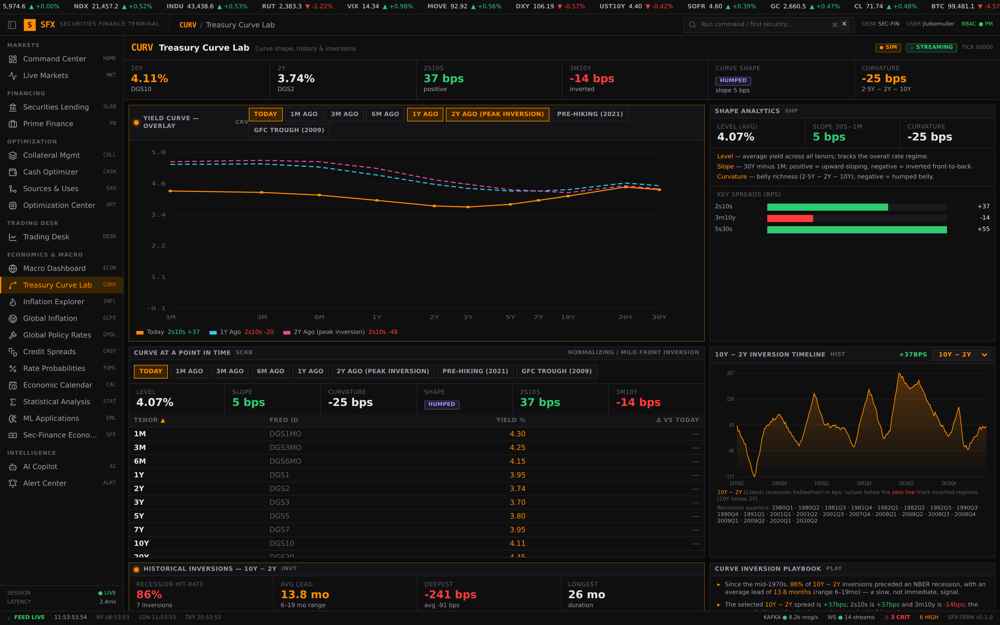
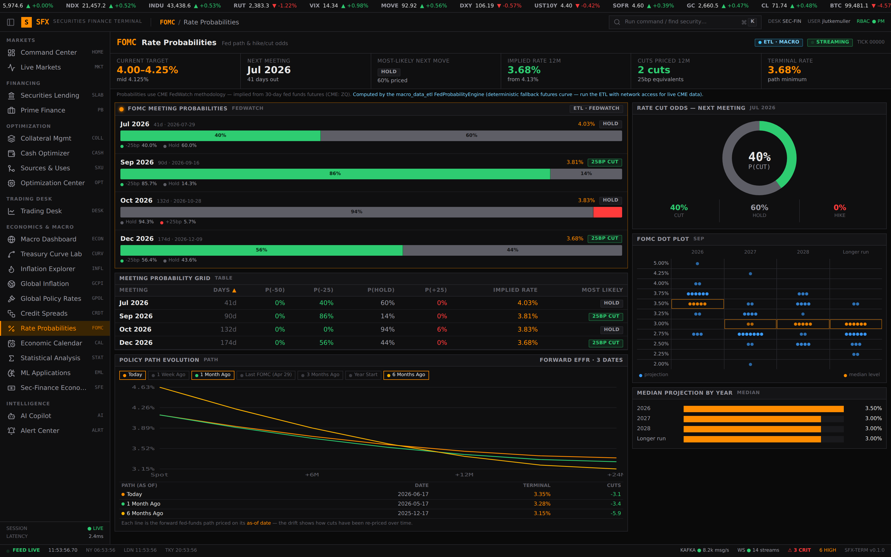
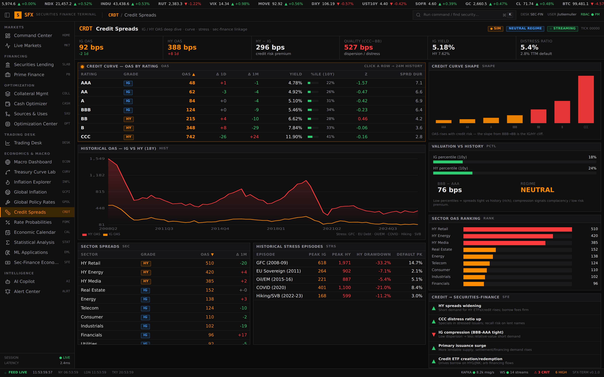
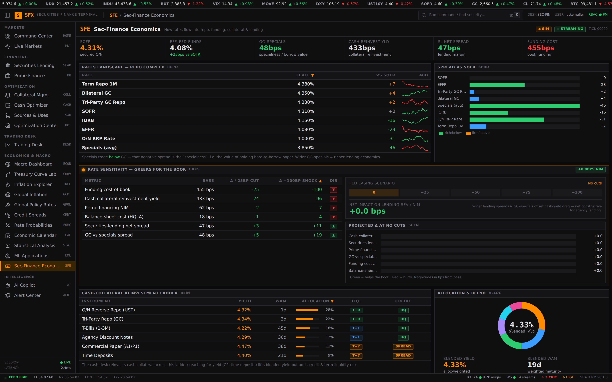
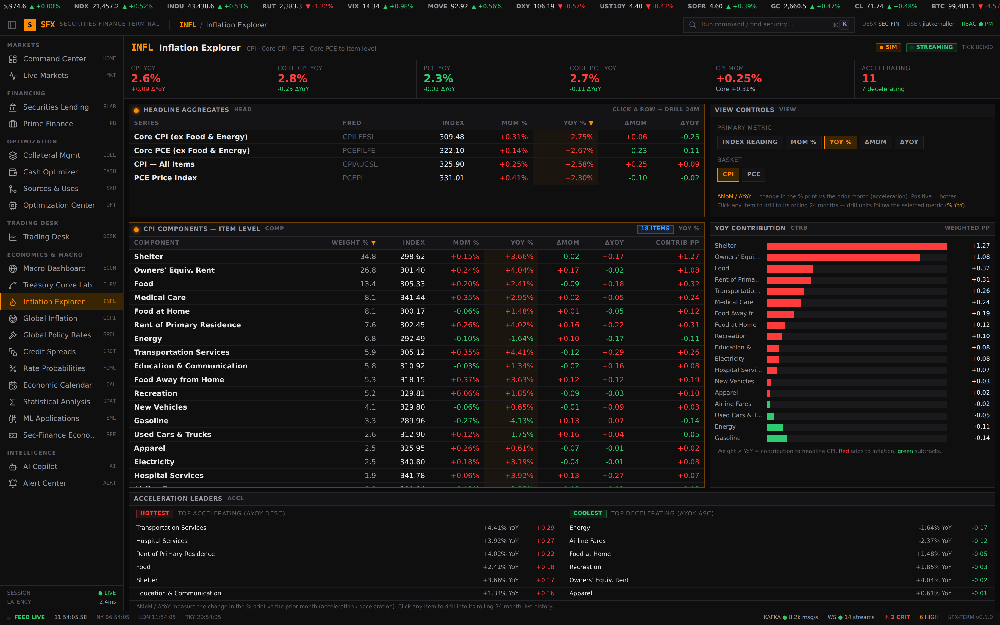
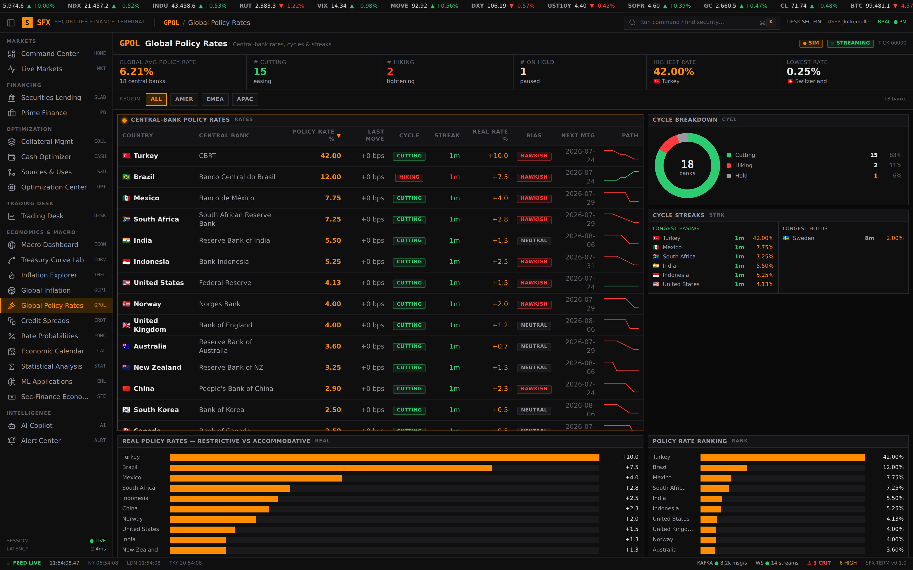
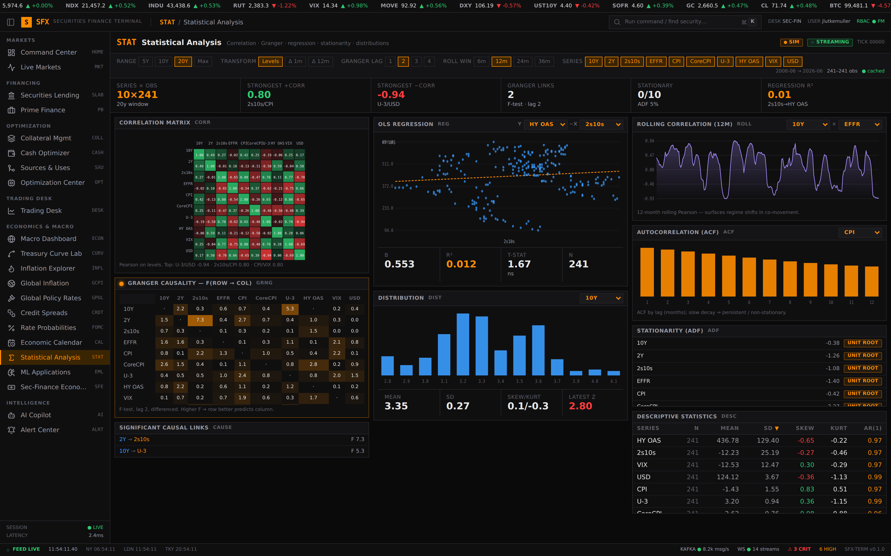

# Economics & Macro — Functionality Summary & Securities-Lending Relevance

A short tour of the QIT Terminal's **Economics & Macro** section and *why each
module matters to a securities-finance desk*. Securities-lending economics are,
at bottom, **a rates-and-funding business**: lending revenue is driven by rebate
rates, the yield earned reinvesting cash collateral, the spread of specials over
general collateral (GC), balance-sheet/funding cost, and the risk appetite that
drives short demand and collateral values. Every one of those inputs is a macro
variable — so the macro section is not a sidebar, it is the **pricing and
risk backdrop for the entire book.**

> Data provenance: the macro modules are wired to **FRED** (units-corrected) and
> the Rate Probabilities module to the **`macro_data_etl` FedWatch engine**; a
> green `LIVE · FRED` / blue `ETL · MACRO` badge marks live panels, amber `SIM`
> marks the deterministic fallback. See the root `README.md`.

---

## 1. Macro Dashboard (`ECON`)

FRED-connected indicators grouped by **Growth · Inflation · Labor · Rates &
Curve · Consumer**, each with prior, change, YoY surprise and a sparkline, plus a
live series explorer.

**Why it matters to securities lending:** the macro regime sets **short demand
and collateral risk**. Slowing growth and rising unemployment increase directional
short interest (more borrow demand, richer specials), while the inflation/rates
mix drives the Fed reaction function that prices rebates and reinvestment yield.
This is the desk's one-screen "state of the world" before pricing a single loan.

---

## 2. Treasury Curve Lab (`CURV`)

The live Treasury curve with multi-snapshot overlays, level/slope/curvature, a
point-in-time scrubber, and a **user-selectable spread** (10Y-2Y default) driving
an inversion timeline and historical inversion → recession lead-time analysis.

**Why it matters to securities lending:** the curve *is* the term structure of
**funding and reinvestment carry**. The shape determines what the desk earns
rolling a cash-collateral reinvestment ladder versus its overnight funding cost,
and an inverted 2s10s both compresses that carry and flags the recessionary
regime that historically spikes short demand and HTB specials.

---

## 3. Rate Probabilities (`FOMC`)

CME-FedWatch-style meeting hike/cut odds — now computed by the **`macro_data_etl`
FedProbabilityEngine** from Fed Funds futures — with a Policy Path Evolution
overlay, implied path, and the FOMC dot plot.

**Why it matters to securities lending:** the forward fed-funds path is the
**single biggest driver of lending P&L**. Rebate rates reprice off the policy
rate, and the yield on reinvested cash collateral is a direct function of where
the Fed goes. The implied path lets the desk project reinvestment income and
stress a "what if the Fed cuts 25/50bp" scenario across the whole book.

---

## 4. Credit Spreads (`CRDT`)

ICE BofA IG/HY OAS deep dive — credit curve by rating (drillable), an 18-year
IG-vs-HY history with stress episodes, sector spreads, valuation percentiles, and
an explicit **credit → sec-finance linkage**.

**Why it matters to securities lending:** credit spreads price **counterparty
risk and collateral quality**. Widening HY OAS raises haircuts on lower-grade
collateral, signals counterparty stress in the lending program, and typically
coincides with surging short demand in the credit complex — directly moving both
the revenue and the risk side of the book.

---

## 5. Sec-Finance Economics (`SFE`) — the explicit bridge

The differentiator: the **repo complex** (Term Repo, GC, Tri-Party, SOFR, EFFR,
IORB, O/N RRP, specials), **rate sensitivities — "greeks for the book"** with a
Fed-cut scenario stepper, the **cash-collateral reinvestment ladder**, and the
macro → business linkage.

**Why it matters to securities lending:** this *is* securities-lending economics,
translated one-to-one. It shows funding cost of book, reinvestment yield, prime
financing NIM, GC-vs-specials spread, and how each moves per basis point of
rate change — turning the abstract macro backdrop into the desk's actual revenue,
spread, and rate-risk numbers.

---

## 6. Inflation Explorer (`INFL`)

CPI / Core CPI / PCE / Core PCE to **item level** — index reading, MoM%, YoY%,
and ΔMoM/ΔYoY acceleration, with a contribution waterfall and CPI/PCE toggle.

**Why it matters to securities lending:** inflation drives the **Fed reaction
function**, and therefore the entire rate/rebate/reinvestment chain above. An
upside CPI surprise that pushes the implied path higher feeds straight through to
funding costs and reinvestment yield — the desk reads inflation to anticipate
rates before they move.

---

## 7. Global Policy Rates (`GPOL`)

Central-bank rates, cycles, real rates, streaks and next meetings by country,
with cross-region cut/hike breakdown.

**Why it matters to securities lending:** lending programs are **multi-currency**.
Non-USD policy rates set the rebate and reinvestment economics for international
inventory and the cross-currency funding basis, while divergence between central
banks creates the FX-hedged funding opportunities a global desk arbitrages.

---

## 8. Statistical Analysis (`STAT`)

Up to 20 years of live FRED history with adjustable lookback/transform/lag —
correlation matrix, **Granger causality (F-test)**, OLS regression, ADF
stationarity, rolling correlation, ACF, distributions and moments.

**Why it matters to securities lending:** it lets the desk **quantify and test**
the linkages the rest of the section asserts — e.g. does the policy rate Granger-
cause the GC-specials spread, how tightly do HY OAS and balance-sheet cost move,
what's the lead-lag between the curve and short demand. It turns macro intuition
into measured, defensible drivers of lending revenue and risk.

---

### Bottom line

Securities-lending revenue and risk are a direct function of **rates, funding,
credit and the broad regime.** The Economics & Macro section delivers that
backdrop live (FRED + FedWatch ETL), and the **Sec-Finance Economics** module
closes the loop by translating it into the desk's own repo, reinvestment, spread
and rate-sensitivity numbers — so macro context and book economics live on the
same screen.
